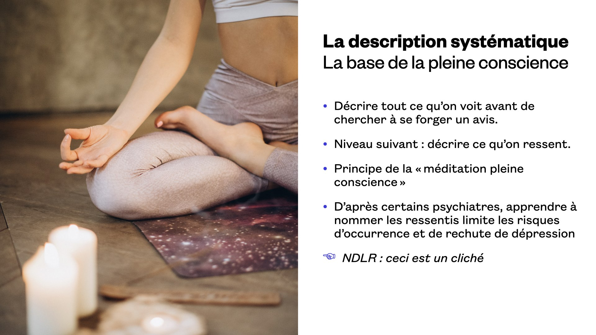

Transcription de la conférence donnée le 22 octobre 2020 en ligne, au Forum PHP.

# Qui suis-je ?

Je m'appelle Agnès Haasser. Je suis développeuse web depuis une dizaine d'années. J'ai été salariée en ESN, puis en agence, puis chez un client final. À présent je suis freelance, depuis 4 mois donc tout récent.

Mais je ne suis pas que développeuse. Cela fait quinze ans que je m'investis dans diverses associations. Depuis trois ans je fais partie d'une association de soutien à l'allaitement. Dans ce cadre, j'écoute des mères qui ont des problèmes d'allaitement. Et aussi, depuis bientôt sept ans je suis mère, et même mère de deux enfants depuis presque cinq ans.

D'habitude, je ne parle pas spécialement de tout cela quand je donne une conférence. Mais en l'occurrence, ces activités extra professionnelles m'ont servi dans ma vie professionnelle, et il me semblait intéressant de partager ces expériences et ce qu'elles m'ont apporté.

# D'où vient cette idée de conférence ?

## Tout a commencé un jour de rétrospective

J'animais la rétrospective d'une autre équipe, qui travaillait sur un projet dont le contexte était tendu. Toutefois l'équipe était soudée, cela se passait bien entre les développeurs.

J'ai pensé que je pourrais les aider à voir le bon côté des choses — leurs collègues à qui ils pouvaient faire confiance — et je leur ai proposé un *icebreaker* qui consistait, chacun à son tour, à adresser un compliment à leur voisin.

Bonne idée, non ? Hé bien non.

Il y a eu un grand et long silence. Je me suis sentie seule ! Peut-être que ce n'était pas assez viril de complimenter un collègue ? Peut-être juste qu'ils ne savaient pas comment faire ?

## Les années de carrière amènent d'autres questions compliquées

Plus le temps passe, plus on prend une position de *lead dev* dans laquelle on est amené à évaluer du code : « c'est bon, je peux déployer mon code en prod ? ». On doit aussi évaluer des solutions techniques, effectuer des choix d'architecture : « prend-on plutôt la solution A ou la solution B » ? Ces choix ne sont pas anodins sous prétexte qu'ils sont techniques : ils orientent la façon dont on va travailler pendant plusieurs années, et peuvent mettre en jeu l'avenir d'un projet ou d'une entreprise.

On est aussi amené à évaluer des humains : « que penses-tu de ce candidat ? Comment ça se passe avec le nouveau, est-ce qu'on valide sa période d'essai ? ». Ou plus simplement, « est-ce que ça se passe bien avec tel collègue, j'ai l'impression que vous ne travaillez pas très bien ensemble… ». Ce n'est pas parce qu'on n'est « que » développeur que personne ne nous demandera d'avis là-dessus, et c'est une bonne chose. Mais ça peut être très délicat si on n'y a pas été formé, et il est facile de blesser dans ces situations…

Il y a aussi les questions sur le produit : « est-ce qu'on pourrait ajouter un bouton sur l'écran X, qui ferait truc, et ensuite ça nous emmènerait sur la page Y avec le message bidule, etc. Ah, combien de temps ça va prendre ? »

Et la plus importante car c'est celle sur laquelle on ment le plus : « est-ce que ça va ? ».

## Soft skillz iz hard

# Les bases de la CNV

